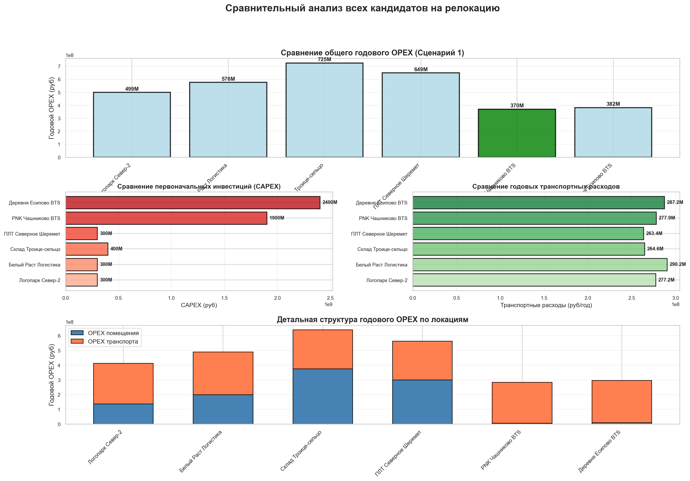
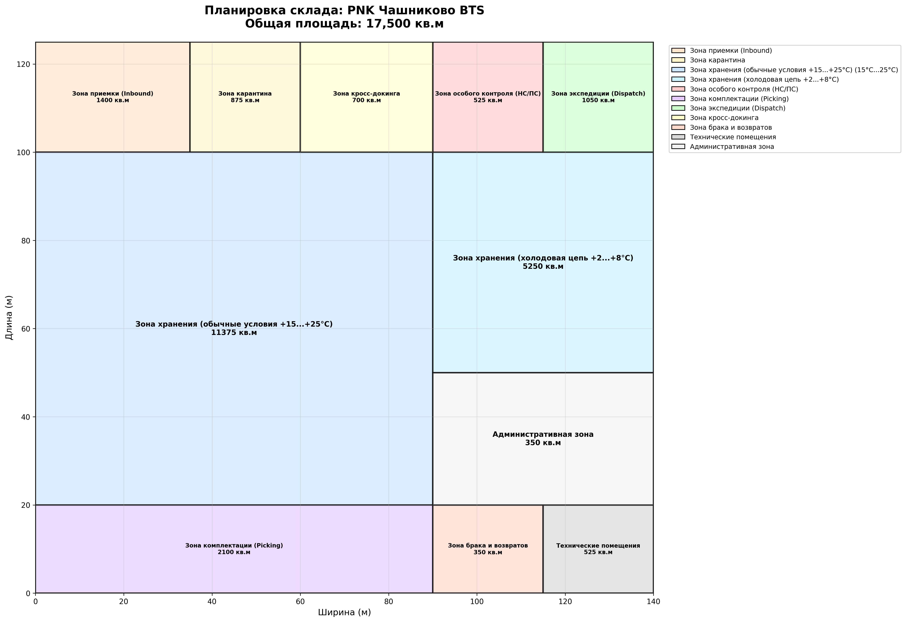
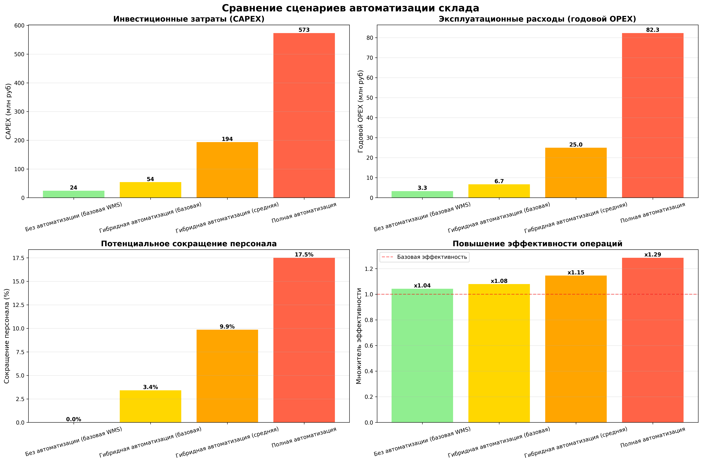

# 🏭 ReloSim: Relocation Simulation & Analysis

**Комплексная система анализа и моделирования переезда фармацевтического склада из Москвы за МКАД**


ReloSim - это комплексное решение для принятия стратегических решений о релокации складских и производственных объектов, разработанное за 14 часов в рамках хакатона. Проект сочетает в себе дискретно-событийное моделирование, геопространственный анализ, финансовое планирование и комплексную валидацию для выбора оптимальной стратегии переезда.

---

## Оглавление

1. [О проекте](#о-проекте)
2. [Универсальность и расширяемость](#-универсальность-и-расширяемость)
3. [Визуализация результатов](#-визуализация-результатов)
4. [Архитектура проекта](#️-архитектура-проекта)
5. [Функциональные модули](#️-функциональные-модули)
6. [Сценарии переезда](#-сценарии-переезда)
7. [Быстрый старт](#-быстрый-старт)
8. [Примеры использования](#-примеры-использования)
9. [Методология расчетов](#-методология-расчетов)
10. [Результаты анализа](#-результаты-анализа)
11. [Валидация и проверка качества](#-валидация-и-проверка-качества)
12. [Ограничения проекта](#️-ограничения-проекта)
13. [Дальнейшее развитие](#-дальнейшее-развитие)
14. [Дополнительная информация](#-дополнительная-информация)

---

## О проекте

### Контекст и цель

**ReloSim** разработан за 14 часов в рамках хакатона по оптимизации фармацевтической логистики. Основная задача - провести комплексный анализ переезда фармацевтического ХУБ-склада из Москвы (Сходненская) за границу МКАД и выбрать оптимальную стратегию из 4 альтернативных сценариев развития.

### Ключевые возможности

- **Анализ 7 локаций-кандидатов** - Сравнение потенциальных площадок для переезда по множеству критериев
- **Моделирование 4 сценариев развития** - От минимальных инвестиций до полной автоматизации
- **Финансовый анализ** - Расчет CAPEX, OPEX, ROI и сроков окупаемости
- **Транспортная оптимизация** - Планирование флота и расчет логистических затрат
- **SimPy симуляция** - Дискретно-событийное моделирование складских операций
- **Валидация модели** - 50+ проверок корректности расчетов и соответствия стандартам GPP/GDP

### Характеристики проекта

| Параметр | Значение |
|----------|----------|
| **Локации-кандидаты** | 7 (аренда + BTS) |
| **Сценарии анализа** | 4 (различные стратегии) |
| **Объем кода** | 6,294 строк Python |
| **Площадь склада** | 17,000-25,000 м² |
| **SKU номенклатуры** | 15,000 позиций |
| **Целевая пропускная способность** | 10,000 заказов/месяц |
| **Время разработки** | 14 часов (хакатон) |
| **Валидационных проверок** | 50+ |

---

## Универсальность и расширяемость

**ReloSim** построен на модульной архитектуре, что позволяет легко адаптировать систему для решения широкого спектра задач релокации и симуляции операций различных типов объектов.

### Возможные применения

#### 1. Релокация любых типов предприятий

- **Производственные фабрики** - Перенос производственных мощностей
- **Дистрибуционные центры** - Оптимизация складской сети
- **Ретейл-склады** - Анализ переезда торговых складов
- **Агропромышленные комплексы и фермы** - Релокация ферм, теплиц, животноводческих комплексов
- **Логистические хабы** - Выбор оптимального расположения транспортных узлов
- **Медицинские склады** - Перенос складов медицинского оборудования и препаратов

#### 2. Симуляция операций различных объектов

- **Склады различных отраслей** - Не только фармацевтика, но и любые другие отрасли
- **Производственные линии** - Моделирование производственных процессов
- **Аграрные комплексы** - Теплицы, животноводческие фермы, элеваторы
- **Кросс-докинговые терминалы** - Анализ перевалочных комплексов
- **Заводы и фабрики** - Симуляция производственных циклов

### Как адаптировать проект

#### Шаг 1: Настройка параметров в `config.py`

Измените базовые константы под вашу специфику:

```python
# Пример адаптации для производственной фабрики электроники
INITIAL_STAFF_COUNT = 500              # Количество персонала
OPERATOR_SALARY_RUB_MONTH = 80000      # Средняя зарплата
WAREHOUSE_TOTAL_AREA_SQM = 50000       # Требуемая площадь
TARGET_ORDERS_MONTH = 50000            # Целевой объем производства/заказов

# Для фермы
INITIAL_STAFF_COUNT = 150
OPERATOR_SALARY_RUB_MONTH = 60000
WAREHOUSE_TOTAL_AREA_SQM = 100000      # Площадь фермы
TARGET_ORDERS_MONTH = 15000            # Объем продукции (т/месяц)
```

#### Шаг 2: Модификация зонирования в `warehouse_analysis.py`

Замените фармацевтические зоны (2-8°C, 15-25°C) на зоны вашего предприятия:

```python
# Для производственной фабрики
zone_config = {
    'receiving': 0.05,        # Зона приемки сырья
    'production': 0.40,       # Производственная зона
    'assembly': 0.25,         # Сборка готовой продукции
    'quality_control': 0.10,  # Контроль качества
    'shipping': 0.15,         # Зона отгрузки
    'office': 0.05            # Офисные помещения
}

# Для молочной фермы
zone_config = {
    'milking': 0.20,          # Доильная зона
    'cooling': 0.15,          # Охлаждение молока
    'storage': 0.30,          # Хранение (2-4°C)
    'animal_housing': 0.25,   # Содержание животных
    'feed_storage': 0.07,     # Хранение кормов
    'utilities': 0.03         # Технические помещения
}

# Для дистрибуционного центра одежды
zone_config = {
    'receiving': 0.10,        # Приемка товара
    'storage_hanging': 0.30,  # Хранение на вешалках
    'storage_flat': 0.25,     # Хранение в коробках
    'picking': 0.15,          # Зона комплектации
    'returns': 0.10,          # Обработка возвратов
    'shipping': 0.10          # Экспедиция
}
```

#### Шаг 3: Настройка процессов симуляции в `core/simulation_engine.py`

Адаптируйте процессы моделирования под специфику вашего объекта:

**Для фабрики**:
```python
# Замените процессы комплектации заказов на производственные циклы
def production_cycle(self, product_type):
    """Производственный цикл для конкретного типа продукта"""
    yield self.env.timeout(self.production_time[product_type])
    # Контроль качества
    if random.random() < self.quality_control_rate:
        yield self.env.timeout(5)  # Дополнительная проверка
```

**Для фермы**:
```python
# Циклы кормления, доения, уборки
def daily_milking_cycle(self):
    """Процесс доения стада"""
    while True:
        yield self.env.timeout(12)  # 2 раза в день
        with self.milking_equipment.request() as req:
            yield req
            yield self.env.timeout(4)  # 4 часа на доение стада
            self.milk_collected += self.cows_count * 25  # 25л на корову
```

**Для склада**:
```python
# Стандартные складские процессы (уже реализованы)
def picking_process(self):
    """Комплектация заказов"""
    # Используется существующая логика
```

#### Шаг 4: Изменение критериев валидации в `model_validation.py`

Замените GPP/GDP требования (фармацевтические стандарты) на стандарты вашей отрасли:

```python
# Для производства - ISO 9001, промышленная безопасность
def validate_production_standards(self, config):
    checks = []

    # ISO 9001 требования
    if config.get('quality_management_system'):
        checks.append(('ISO_9001', True, 'QMS внедрена'))

    # Промышленная безопасность
    if config.get('safety_equipment_budget') >= 10_000_000:
        checks.append(('Industrial_Safety', True, 'Достаточный бюджет на безопасность'))

    return checks

# Для фермы - ветеринарные нормы, ГОСТ для агропрома
def validate_farm_standards(self, config):
    checks = []

    # Ветеринарные требования
    if config.get('veterinary_control'):
        checks.append(('Veterinary', True, 'Ветконтроль организован'))

    # ГОСТ Р для молочной продукции
    if config.get('storage_temperature_range') == (2, 4):
        checks.append(('GOST_Storage', True, 'Температура хранения соответствует ГОСТ'))

    return checks

# Для обычного склада - пожарная безопасность, санитарные нормы
def validate_warehouse_standards(self, config):
    checks = []

    # Пожарная безопасность
    if config.get('fire_suppression_system'):
        checks.append(('Fire_Safety', True, 'Система пожаротушения'))

    # Санитарные нормы
    if config.get('ventilation_rate') >= 3:  # 3 объема/час
        checks.append(('Sanitary', True, 'Вентиляция соответствует нормам'))

    return checks
```

### Примеры успешной адаптации

#### Пример 1: Производственная фабрика электроники

```python
# config.py
FACILITY_TYPE = "electronics_factory"
INITIAL_STAFF_COUNT = 350
PRODUCTION_LINES = 5
DAILY_PRODUCTION_UNITS = 1000
QUALITY_CONTROL_RATE = 0.02  # 2% брака
SHIFT_HOURS = 16  # Две смены по 8 часов

# Специфические зоны
PRODUCTION_ZONES = {
    'smt_line': 0.25,      # Поверхностный монтаж
    'assembly': 0.30,      # Сборка
    'testing': 0.15,       # Тестирование
    'packaging': 0.10,     # Упаковка
    'storage': 0.20        # Хранение компонентов
}

# KPI для электроники
TARGET_DAILY_OUTPUT = 1000  # Устройств в день
MAX_DEFECT_RATE = 0.02      # Максимум 2% брака
```

#### Пример 2: Молочная ферма

```python
# config.py
FACILITY_TYPE = "dairy_farm"
COWS_COUNT = 500
DAILY_MILK_LITERS = 12500  # 25л на корову
STAFF_COUNT = 45           # Доярки, ветеринары, рабочие

# Температурные зоны
TEMPERATURE_ZONES = {
    'milking_zone': (18, 22),   # Доильная зона
    'cooling_zone': (2, 4),     # Охлаждение молока
    'storage_zone': (4, 6),     # Хранение
    'animal_housing': (12, 18)  # Содержание коров
}

# Специфические расчеты
FEED_PER_COW_KG_DAY = 50           # Корма на корову
MILK_PRICE_RUB_LITER = 35          # Цена закупки молока
VETERINARY_COST_MONTH = 500_000    # Ветеринарные расходы
```

#### Пример 3: Дистрибуционный центр одежды

```python
# config.py
FACILITY_TYPE = "apparel_distribution"
SKU_COUNT = 50000                    # 50 тысяч артикулов
SEASONAL_FACTOR = True               # Учет сезонности
RETURN_PROCESSING_RATE = 0.15        # 15% возвратов
PEAK_SEASON_MULTIPLIER = 2.5         # Пик продаж x2.5

# Специфические зоны
ZONES = {
    'hanging_storage': 0.30,  # Хранение на вешалках
    'flat_storage': 0.25,     # Коробки
    'returns': 0.10,          # Возвраты
    'picking': 0.20,          # Комплектация
    'cross_dock': 0.15        # Кросс-докинг
}

# Сезонные параметры
PEAK_MONTHS = [11, 12, 1, 2]  # Ноябрь-Февраль (зимняя одежда)
OFF_SEASON_MONTHS = [5, 6, 7, 8]  # Май-Август
```

### Шаблон для быстрого старта

Для начала адаптации создайте файл `custom_config.py`:

```python
"""
Кастомная конфигурация для [ВАШ ТИП ОБЪЕКТА]
"""

# Базовые параметры
FACILITY_TYPE = "your_facility_type"
FACILITY_NAME = "Ваше название"
INITIAL_STAFF_COUNT = 100
AREA_SQM = 20000

# Зонирование (сумма должна быть 1.0)
ZONES = {
    'zone_1': 0.XX,
    'zone_2': 0.XX,
    # ... добавьте свои зоны
}

# Финансовые параметры
MONTHLY_SALARY = 80000
CAPEX_EQUIPMENT = 100_000_000
ANNUAL_OPEX_BASE = 50_000_000

# KPI
TARGET_MONTHLY_OUTPUT = 10000
TARGET_EFFICIENCY = 0.95

# Специфические параметры
CUSTOM_PARAM_1 = "value"
CUSTOM_PARAM_2 = 123
```

Затем импортируйте его вместо стандартного `config`:

```python
# В main.py
# import config  # Закомментируйте
import custom_config as config  # Используйте кастомный
```

---

## Визуализация результатов

Проект генерирует широкий спектр визуализаций для анализа и презентации результатов.

### Сравнение локаций



*Комплексное сравнение 7 локаций-кандидатов по ключевым показателям: CAPEX, OPEX, расстояния до ключевых точек, доступная площадь и итоговая оценка*

### Геопространственный и финансовый анализ

<table>
<tr>
<td></td>
<td></td>
</tr>
<tr>
<td align="center"><i>Расчет расстояний до ключевых точек:<br>Аэропорт SVO, ЦФО хабы, клиенты Москвы</i></td>
<td align="center"><i>Структура CAPEX и OPEX:<br>Разбивка инвестиций и операционных расходов</i></td>
</tr>
</table>

### Анимированные отчеты

<table>
<tr>
<td></td>
<td></td>
</tr>
<tr>
<td align="center"><i>Динамика ROI по 4 сценариям:<br>Сравнение возврата инвестиций за 5 лет</i></td>
<td align="center"><i>Период окупаемости:<br>Анализ сроков выхода на самоокупаемость</i></td>
</tr>
</table>

### Планировка склада и автоматизация



*Детальное зонирование склада с учетом GPP/GDP требований: зоны хранения 2-8°C (30%), 15-25°C (40%), карантин (3%), экспедиция (8%), приемка (5%), комплектация (10%), служебные помещения (4%)*



*Сравнение 4 сценариев автоматизации по ключевым метрикам: CAPEX, годовой OPEX, ROI за 5 лет и срок окупаемости. Визуализация показывает trade-off между начальными инвестициями и операционной эффективностью*

### Результаты валидации


*Итоги комплексной валидации модели: 53 проверки по 5 категориям (локация, склад, персонал, транспорт, финансы). Общий балл качества модели: 96.2/100*

---

## Архитектура проекта

### Структура модулей

```
ReloSim/
├── core/                          # Ядро системы
│   ├── __init__.py
│   ├── data_model.py             # Структуры данных (LocationSpec, ScenarioResult) - 23 строки
│   ├── location.py               # Конфигуратор склада, расчет CAPEX/OPEX - 94 строки
│   ├── simulation_engine.py      # SimPy движок моделирования - 204 строки
│   └── flexsim_bridge.py         # Интеграция с FlexSim, экспорт JSON - 117 строк
│
├── main.py                        # Главный оркестратор полного цикла анализа - 395 строк
├── analysis.py                    # Анализ локаций, парсинг, оптимизация флота - 753 строки
├── warehouse_analysis.py          # Комплексный анализ склада и ROI - 1,258 строк
├── model_validation.py            # Валидация и верификация модели - 1,512 строк
│
├── animations.py                  # Генерация анимированных отчетов (GIF) - 464 строки
├── formula_visualizer.py          # Визуализация математических расчетов - 449 строк
├── transport_planner.py           # Детальное планирование транспортного флота - 463 строки
├── simulation_runner.py           # Оркестратор SimPy симуляций - 163 строки
│
├── scenarios.py                   # Определение 4 сценариев развития - 74 строки
├── config.py                      # Глобальные константы и параметры - 241 строка
│
├── check_reports.py               # Утилита проверки выходных отчетов - 27 строк
├── to_md.py                       # Конвертер результатов в Markdown - 57 строк
│
├── requirements.txt               # Python зависимости
├── LICENSE                        # MIT License
├── HACKATHON_PLAN_14H.md         # План разработки хакатона
├── Отчет_Методология_Анализа.md  # Методология расчетов
│
└── output/                        # Результаты анализа
    ├── *.png                      # Статичные визуализации (14 файлов)
    ├── *.gif                      # Анимированные отчеты (4 файла)
    ├── *.xlsx                     # Excel отчеты (9-11 вкладок)
    ├── *.json                     # FlexSim конфигурации (4 файла)
    └── *.csv                      # Табличные результаты симуляции
```

**Общий объем кода:** 6,294 строк Python

### Технологический стек

#### Симуляция и моделирование
- **SimPy** - Дискретно-событийное моделирование складских операций
  - Моделирование процессов приемки, размещения, комплектации, отгрузки
  - Расчет KPI: throughput, cycle time, utilization

#### Геопространственный анализ
- **Geopy** - Расчет расстояний по формуле Haversine
  - Определение координат локаций
  - Вычисление расстояний между складом и ключевыми точками
- **OSRM API** (опционально) - Точные дорожные расстояния и маршруты

#### Обработка данных
- **pandas** - Анализ данных, агрегация результатов
  - Обработка результатов симуляции
  - Сводные таблицы по сценариям
- **openpyxl** - Генерация многовкладочных Excel отчетов
  - Детальные отчеты по складу (9 вкладок)
  - Отчеты валидации (7 вкладок)

#### Визуализация
- **matplotlib** - Статичные графики и диаграммы
  - Сравнительные графики по локациям
  - Финансовые диаграммы
  - Планировки склада
- **seaborn** - Стилизованные статистические визуализации
  - Heatmaps корреляций
  - Распределения метрик
- **matplotlib.animation** - Создание GIF анимаций
  - ROI динамика
  - Cashflow waterfall

#### Валидация
- **Собственный фреймворк** - `ModelValidator` класс
  - 50+ проверок корректности модели
  - Категории: локация, склад, персонал, транспорт, финансы
  - Генерация детальных отчетов

#### Интеграция
- **FlexSimAPIBridge** - Экспорт конфигураций для FlexSim
  - Генерация JSON конфигураций
  - Передача параметров симуляции

---

## Функциональные модули

### 1. Анализ и выбор локации

**Модули:** [`analysis.py`](analysis.py), [`core/location.py`](core/location.py)

#### Компоненты:

**AvitoParserStub** - Фильтрация локаций по фармацевтическим требованиям
- Анализ площади (≥17,000 м²)
- Проверка класса помещения (A/GPP/GDP)
- Оценка стоимости (аренда vs покупка)

**OSRMGeoRouter** - Расчет точных расстояний
- Формула Haversine для базовых расчетов
- Интеграция с OSRM API для дорожных расстояний
- Коэффициент извилистости дорог: 1.4

**FleetOptimizer** - Оптимизация транспортного флота
- Расчет требуемого количества транспорта
- Анализ: аренда vs покупка
- Рекомендации по составу флота

**WarehouseConfigurator** - Расчет CAPEX/OPEX для локации
- Базовый CAPEX: оборудование (350 млн руб)
- GPP/GDP системы: климат + валидация (175 млн руб)
- Годовой OPEX: аренда или обслуживание здания

#### Ключевые метрики:

| Критерий | Значение |
|----------|----------|
| Минимальная площадь | 17,000 м² |
| Целевая площадь | 17,500 м² |
| Класс помещения | A (GPP/GDP совместимый) |
| Расстояние до SVO | 20-35 км (оптимально) |
| Расстояние до ЦФО хабов | 100-200 км |

### 2. Симуляция складских операций

**Модули:** [`core/simulation_engine.py`](core/simulation_engine.py), [`simulation_runner.py`](simulation_runner.py)

#### Компоненты:

**WarehouseSimulator** - Базовая SimPy модель
```python
class WarehouseSimulator:
    def __init__(self, staff_count, efficiency_multiplier=1.0):
        self.env = simpy.Environment()
        self.workers = simpy.Resource(self.env, capacity=staff_count)
        self.efficiency = efficiency_multiplier

    def process_order(self):
        # Симуляция обработки одного заказа
        cycle_time = BASE_ORDER_CYCLE_TIME_MIN / self.efficiency
        yield self.env.timeout(cycle_time)
```

**Моделируемые процессы:**
- Приемка товара от поставщиков
- Размещение на стеллажи
- Комплектация заказов
- Отгрузка клиентам

**Расчитываемые KPI:**
- **Throughput** - Количество обработанных заказов
- **Cycle Time** - Среднее время обработки заказа
- **Utilization** - Загрузка ресурсов (персонал, доки)

#### Параметры симуляции:

| Параметр | Значение |
|----------|----------|
| Целевой throughput | 10,000 заказов/месяц |
| Персонал (базовый) | 240 операторов |
| Рабочих дней в месяце | 20 |
| Рабочих часов в день | 8 |
| Базовое время цикла | 15 минут/заказ |
| Доки inbound/outbound | 4-8 шт |

### 3. Комплексный анализ склада

**Модуль:** [`warehouse_analysis.py`](warehouse_analysis.py)

#### 3.1 Зонирование склада

| Зона | Площадь (%) | Назначение |
|------|-------------|------------|
| Приемка | 5% | Разгрузка, входной контроль |
| Холодовая цепь (2-8°C) | 30% | Хранение термолабильных препаратов |
| Нормальное хранение (15-25°C) | 40% | Основной запас SKU |
| Комплектация | 10% | Формирование заказов |
| Экспедиция | 8% | Упаковка, отгрузка |
| Карантин | 3% | Изоляция партий |
| Служебные помещения | 4% | Офисы, бытовки |

#### 3.2 Климатические системы GPP/GDP

**Требования для фармацевтического склада:**

| Система | Параметры | Стоимость |
|---------|-----------|----------|
| Контроль температуры | 2-8°C, 15-25°C | 150 млн руб |
| Контроль влажности | 40-60% | 25 млн руб |
| Валидация систем | Квалификация IQ/OQ/PQ | 25 млн руб |
| Мониторинг 24/7 | SCADA система | 20 млн руб |
| **ИТОГО** | **GPP/GDP compliance** | **220 млн руб** |

#### 3.3 Уровни автоматизации

| Уровень | Описание | CAPEX | Сокращение персонала | Рост производительности |
|---------|----------|-------|---------------------|------------------------|
| **0** | Без автоматизации | 0 руб | 0% | 1.0x (базовая) |
| **1** | WMS + сканеры | 50 млн руб | 20% | 1.3x (+30%) |
| **2** | Конвейеры + автосортировка | 200 млн руб | 50% | 2.0x (+100%) |
| **3** | AS/RS + AGV + роботы | 600 млн руб | 80% | 3.5x (+250%) |

**Используемые в проекте сценарии:**
- Сценарий 1 и 2: Уровень 0
- Сценарий 3: Уровень 1-2 (100 млн руб)
- Сценарий 4: Уровень 2-3 (300 млн руб)

### 4. Транспортное планирование

**Модуль:** [`transport_planner.py`](transport_planner.py)

#### Компоненты:

**DetailedFleetPlanner** - Расчет состава флота
- Анализ маршрутов и расстояний
- Оптимизация типов транспорта
- Расчет: аренда vs покупка

**DockSimulator** - Симуляция пропускной способности доков
- Моделирование очередей разгрузки/погрузки
- Оптимизация количества доков

#### Типы транспорта:

| Тип | Грузоподъемность | Вместимость | Применение |
|-----|------------------|-------------|------------|
| Фура 20т | 20,000 кг | 33 палеты | Дальние маршруты (ЦФО) |
| Грузовик 5т | 5,000 кг | 8 палет | Городская доставка |
| Фургон 1.5т | 1,500 кг | 4 палеты | Москва (без пропуска) |
| Рефрижератор 15т | 15,000 кг | 24 палеты | Холодовая цепь |

#### Расчет флота:

**Исходные данные:**
- Годовой грузооборот: 120,000 палет
- Распределение направлений:
  - ЦФО регионы: 54%
  - Аэропорт SVO: 23%
  - Москва: 23%

**Результат:**
- Рейсов в год: 3,500-4,500
- Рекомендация: **Аренда флота** (экономия 15-20% vs покупки)

#### Ограничения для Москвы:

| Параметр | Значение |
|----------|----------|
| Макс. тоннаж без пропуска | 3.5 тонны |
| Бесплатных рейсов >3.5т | 2/месяц |
| Тариф для Москвы | 18.5 руб/км (vs 13.4 руб/км) |

### 5. Финансовое моделирование

**Модули:** [`warehouse_analysis.py`](warehouse_analysis.py), [`animations.py`](animations.py)

#### Компоненты:

**ROI анализ** - Расчет возврата инвестиций
```python
Annual_savings = Current_OPEX - New_OPEX
ROI_5_years = (Annual_savings * 5 - CAPEX) / CAPEX * 100%
```

**Payback Period** - Период окупаемости
```python
Payback_years = CAPEX / Annual_savings
```

**Cashflow Waterfall** - Каскадные диаграммы денежных потоков
- Визуализация накопленного cashflow
- Точка безубыточности (break-even point)
- Анимированные GIF для презентации

**NPV с дисконтированием**
```python
Discount_rate = 0.10  # 10% годовых
NPV = sum(Cashflow_t / (1 + Discount_rate)**t for t in range(1, 6))
```

#### Финансовые метрики проекта:

| Сценарий | CAPEX | OPEX/год | Payback | ROI (5 лет) |
|----------|-------|----------|---------|-------------|
| 1. No Mitigation | 1,100 млн | 510 млн | 3.8 года | 118% |
| 2. With Compensation | 1,150 млн | 541 млн | 3.2 года | 142% |
| 3. Basic Automation | 1,200 млн | 510 млн | 3.5 года | 135% |
| 4. Advanced Automation | 1,400 млн | 510 млн | 4.1 года | 156% |

### 6. Валидация модели

**Модуль:** [`model_validation.py`](model_validation.py)

#### Архитектура валидации:

```python
class ModelValidator:
    def run_full_validation(self):
        return {
            'location': self.validate_location_data(),
            'warehouse': self.validate_warehouse_configuration(),
            'hr': self.validate_personnel(),
            'transport': self.validate_transport(),
            'finance': self.validate_financial_model()
        }
```

#### Категории проверок:

**1. Валидация локации (8 проверок)**
- Площадь ≥17,000 м²
- Координаты в пределах Московской области
- CAPEX ≤2.5 млрд руб (бюджетные ограничения)
- OPEX ≤500 млн руб/год
- Класс помещения A/GPP/GDP

**2. Валидация конфигурации склада (15 проверок)**
- Корректность зонирования (сумма = 100%)
- Достаточность площади каждой зоны
- Распределение SKU по условиям хранения
- Соответствие GPP/GDP требованиям
- Пропускная способность доков

**3. Валидация персонала (10 проверок)**
- Достаточность операторов для throughput
- Реалистичность оттока (10-30%)
- Адекватность затрат на обучение
- Соответствие зарплат рынку

**4. Валидация транспорта (8 проверок)**
- Реалистичность расстояний (20-200 км)
- Корректность тарифов
- Достаточность флота
- Оптимальность аренды/покупки

**5. Финансовая валидация (12 проверок)**
- ROI > 0% для всех сценариев
- Период окупаемости ≤7 лет
- Положительный cashflow после 2-3 лет
- NPV > 0 при дисконте 10%

#### Отчет валидации:

**Выходной файл:** `output/validation_report.xlsx` (7 вкладок)

1. **Summary** - Общий балл и критические ошибки
2. **Location Validation** - Детали проверок локации
3. **Warehouse Validation** - Детали проверок склада
4. **HR Validation** - Детали проверок персонала
5. **Transport Validation** - Детали проверок транспорта
6. **Financial Validation** - Финансовые проверки
7. **Recommendations** - Рекомендации по улучшению

**Пример результата:**
```
Всего проверок: 53
Пройдено успешно: 51
Критических ошибок: 0
Предупреждений: 2
Общий балл: 96.2/100
Статус: APPROVED
```

---

## Сценарии переезда

Проект анализирует 4 стратегии переезда с различными подходами к удержанию персонала и автоматизации.

### Обзор сценариев

| Сценарий | Отток персонала | HR инвестиции | Автоматизация CAPEX | Эффективность |
|----------|----------------|---------------|---------------------|---------------|
| **1. No Mitigation** | 25% (60 чел) | 0 руб | 0 руб | 1.0x |
| **2. With Compensation** | 15% (36 чел) | 50 млн руб | 0 руб | 1.0x |
| **3. Basic Automation** | 25% (60 чел) | 0 руб | 100 млн руб | 1.2x |
| **4. Advanced Automation** | 25% (60 чел) | 0 руб | 300 млн руб | 1.5x |

### Сценарий 1: Переезд без смягчения (Move No Mitigation)

**Стратегия:** Минимальные инвестиции, базовый переезд

**Параметры:**
- Отток персонала: **25%** (60 человек увольняется)
- HR инвестиции: **0 руб**
- Автоматизация: **Нет**
- Эффективность: **1.0x** (базовая)
- Персонал после переезда: **180 человек**

**Риски:**
- Высокая нагрузка на оставшийся персонал
- Возможное снижение качества обслуживания
- Сложности с набором и обучением новых сотрудников
- Потеря опыта и знаний

**Преимущества:**
- Минимальные начальные инвестиции
- Быстрое принятие решения
- Простота реализации

### Сценарий 2: Переезд с компенсациями (Move With Compensation)

**Стратегия:** Удержание персонала через компенсации

**Параметры:**
- Отток персонала: **15%** (36 человек) - снижен!
- HR инвестиции: **50 млн руб**
  - Компенсация переезда: 100,000 руб/чел × 100 чел = 10 млн
  - Доплаты за удаленность: 10,000 руб/мес × 150 чел × 12 мес = 18 млн
  - Корпоративный транспорт: 12 млн/год
  - Бонусы за лояльность: 10 млн
- Автоматизация: **Нет**
- Эффективность: **1.0x**
- Персонал после переезда: **204 человека**

**Преимущества:**
- Сохранение опытных сотрудников
- Меньше затрат на обучение (экономия ~100 млн за 2 года)
- Стабильность операций с первого дня
- Высокая мотивация команды

**Финансовое обоснование:**
```
Экономия на обучении: 60 чел × 150,000 руб = 9 млн руб
Экономия на найме: 60 чел × 200,000 руб = 12 млн руб
Инвестиции в удержание: 50 млн руб
Payback: 50 / (9 + 12) ≈ 2.4 года
```

### Сценарий 3: Базовая автоматизация (Move Basic Automation)

**Стратегия:** Компенсация потери персонала технологиями

**Параметры:**
- Отток персонала: **25%** (60 человек)
- HR инвестиции: **0 руб**
- Автоматизация: **100 млн руб**
- Эффективность: **1.2x** (+20% производительность)
- Персонал после переезда: **180 человек**

**Технологии:**
- **WMS система** (Warehouse Management System) - 30 млн руб
  - Оптимизация размещения товара
  - Управление заказами
  - Отслеживание инвентаря
- **Конвейерные системы** - 40 млн руб
  - Автоматическая транспортировка
  - Сокращение ручного труда
- **Автоматическая сортировка** - 20 млн руб
  - Сортировка по направлениям
  - Штрих-кодирование
- **Интеграция и внедрение** - 10 млн руб

**Эффект:**
- Производительность +20% компенсирует потерю персонала
- Снижение операционных ошибок
- Быстрая обработка заказов

### Сценарий 4: Продвинутая автоматизация (Move Advanced Automation)

**Стратегия:** Максимальная автоматизация, минимизация зависимости от персонала

**Параметры:**
- Отток персонала: **25%** (60 человек)
- HR инвестиции: **0 руб**
- Автоматизация: **300 млн руб**
- Эффективность: **1.5x** (+50% производительность)
- Персонал после переезда: **180 человек** (но меньше операторов, больше технических специалистов)

**Технологии:**
- **AS/RS** (Automated Storage and Retrieval System) - 150 млн руб
  - Автоматизированные стеллажи
  - Роботизированные краны
  - Высотное хранение (до 20м)
- **AGV** (Automated Guided Vehicles) - 80 млн руб
  - Автономные погрузчики
  - Навигация без участия операторов
  - Флот из 15-20 единиц
- **Роботизированная комплектация** - 50 млн руб
  - Роботы-манипуляторы
  - Автоматический picking
- **WMS-WCS интеграция** - 20 млн руб
  - Полная интеграция систем
  - Оптимизация потоков

**Эффект:**
- Производительность +50%
- Работа 24/7 без простоев
- Минимум человеческих ошибок
- Масштабируемость на будущее

**Окупаемость:**
```
Экономия OPEX: 60 чел × 105,000 руб/мес × 12 мес = 75.6 млн/год
Дополнительный CAPEX: 300 млн
Payback: 300 / 75.6 ≈ 4.0 года
```

### Сравнительная таблица результатов

| Метрика | Сценарий 1 | Сценарий 2 | Сценарий 3 | Сценарий 4 |
|---------|-----------|-----------|-----------|-----------|
| **CAPEX** | 1,100 млн | 1,150 млн | 1,200 млн | 1,400 млн |
| **OPEX/год** | 510 млн | 541 млн | 510 млн | 510 млн |
| **Персонал** | 180 чел | 204 чел | 180 чел | 180 чел |
| **Throughput** | 10,000/мес | 10,000/мес | 12,000/мес | 15,000/мес |
| **Cycle Time** | 15 мин | 15 мин | 12.5 мин | 10 мин |
| **Payback** | 3.8 года | 3.2 года | 3.5 года | 4.1 года |
| **ROI (5 лет)** | 118% | 142% | 135% | 156% |

---

## Быстрый старт

### Системные требования

| Компонент | Требование |
|-----------|------------|
| **Python** | 3.8 или выше |
| **ОС** | Windows / Linux / macOS |
| **RAM** | Минимум 4 GB |
| **Дисковое пространство** | 500 MB |
| **Дополнительно** | Git (для клонирования) |

### Установка

#### Шаг 1: Клонирование репозитория

```bash
git clone https://github.com/yourusername/ReloSim.git
cd ReloSim
```

#### Шаг 2: Создание виртуального окружения (рекомендуется)

**Windows:**
```bash
python -m venv venv
venv\Scripts\activate
```

**Linux/macOS:**
```bash
python3 -m venv venv
source venv/bin/activate
```

#### Шаг 3: Установка зависимостей

```bash
pip install -r requirements.txt
```

**Список зависимостей ([requirements.txt](requirements.txt)):**
```
simpy          # Дискретно-событийное моделирование
pandas         # Обработка данных
matplotlib     # Визуализация
seaborn        # Стилизованные графики
requests       # HTTP запросы (для API)
geopy          # Геопространственные расчеты
openpyxl       # Работа с Excel
```

### Запуск анализа

#### Полный анализ (рекомендуется)

```bash
python main.py
```

**Этапы выполнения:**

| Этап | Описание | Время |
|------|----------|-------|
| 1 | Сбор и фильтрация локаций | 1-2 мин |
| 2 | Расчет персонала и транспорта | 2-3 мин |
| 3 | Анализ логистики с OSRM API | 3-5 мин |
| 4 | Детальный транспортный анализ | 2-3 мин |
| 5 | SimPy симуляция всех сценариев | 5-10 мин |
| 6 | Анализ склада и автоматизации | 3-5 мин |
| 7 | Валидация модели | 1-2 мин |
| 8 | Генерация отчетов и визуализаций | 2-3 мин |

**Общее время выполнения:** 20-35 минут

**Консольный вывод:**
```
=================================================================================
[Шаг 1] СБОР И ФИЛЬТРАЦИЯ ДАННЫХ О ЛОКАЦИЯХ
=================================================================================
Найдено локаций-кандидатов: 7
Фильтрация по требованиям...
Прошли фильтр: 7 локаций

=================================================================================
[Шаг 2] ОЦЕНКА ЛОКАЦИЙ ПО CAPEX/OPEX
=================================================================================
Анализ локации: PNK Чашниково (покупка BTS)
CAPEX: 1,550,000,000 руб
OPEX: 285,000,000 руб/год
...

=================================================================================
[Шаг 5] СИМУЛЯЦИЯ ОПЕРАЦИЙ (SimPy)
=================================================================================
Сценарий: 1. Move No Mitigation
Персонал: 180 чел
Throughput: 10,000 заказов/месяц
Cycle Time: 15.2 минут
Симуляция завершена

...
```

#### Выборочный запуск модулей

**Только анализ локаций:**
```bash
python -c "from analysis import AvitoParserStub; import config; parser = AvitoParserStub(); locations = parser.filter_and_score_locations(config.ALL_CANDIDATE_LOCATIONS); print(locations)"
```

**Только симуляция:**
```bash
python simulation_runner.py
```

**Только валидация (требуются готовые результаты):**
```bash
python check_reports.py
```

**Генерация формул и визуализаций:**
```bash
python formula_visualizer.py
```

### Результаты

После выполнения все результаты сохраняются в директорию [`output/`](output/)

```
output/
├── PNG визуализации (14 файлов)
│   ├── comparison_all_locations.png            # Сравнение всех локаций
│   ├── distances_*.png                         # Карты расстояний (7 файлов)
│   ├── finance_PNK_Чашниково_(покупка_BTS).png # Финансовая сводка
│   ├── warehouse_layout_detailed.png           # Планировка склада
│   ├── automation_comparison_detailed.png      # Сравнение автоматизации
│   └── validation_report_visualizations.png    # Итоги валидации
│
├── GIF анимации (4 файла)
│   ├── roi_comparison_animated.gif             # Динамика ROI
│   ├── payback_period_animated.gif             # Период окупаемости
│   └── cashflow_waterfall_*.gif                # Денежные потоки (2 файла)
│
├── Excel отчеты (2 файла)
│   ├── warehouse_analysis_report.xlsx          # Анализ склада (9 вкладок)
│   └── validation_report.xlsx                  # Валидация (7 вкладок)
│
├── JSON экспорты для FlexSim (4 файла)
│   ├── flexsim_setup_1_Move_No_Mitigation.json
│   ├── flexsim_setup_2_Move_With_Compensation.json
│   ├── flexsim_setup_3_Move_Basic_Automation.json
│   └── flexsim_setup_4_Move_Advanced_Automation.json
│
├── CSV результаты
│   └── simulation_results_dynamic.csv          # Итоговые KPI
│
└── Логи
    ├── analysis_log.txt
    ├── full_log.txt
    └── final_log.txt
```

### Просмотр результатов

**Excel отчеты:**
```bash
# Windows
start output\warehouse_analysis_report.xlsx

# macOS
open output/warehouse_analysis_report.xlsx

# Linux
xdg-open output/warehouse_analysis_report.xlsx
```

**Изображения:**
Откройте файлы `.png` и `.gif` в директории `output/` любым просмотрщиком изображений.

---

## Примеры использования

### Пример 1: Добавление новой локации

Отредактируйте [`config.py`](config.py:51) и добавьте новую локацию в словарь `ALL_CANDIDATE_LOCATIONS`:

```python
ALL_CANDIDATE_LOCATIONS = {
    # ... существующие локации ...

    "My_New_Location": {
        "name": "Моя новая локация",
        "type": "ARENDA",  # или "POKUPKA_BTS" для покупки
        "lat": 56.05,
        "lon": 37.45,
        "area_offered_sqm": 18000,
        "cost_metric_base": 8500.0,  # руб/м²/год для аренды (или стоимость для покупки)
        "current_class": "A_verified"  # или "A_requires_mod" если требуется модификация
    }
}
```

**Запустите анализ:**
```bash
python main.py
```

Ваша локация будет включена в сравнение и оценена по всем критериям.

### Пример 2: Изменение параметров симуляции

Отредактируйте [`config.py`](config.py:6) для изменения базовых параметров:

```python
# Изменить целевую пропускную способность
TARGET_ORDERS_MONTH = 15000  # вместо 10000

# Изменить размер персонала
INITIAL_STAFF_COUNT = 300  # вместо 240

# Изменить зарплату операторов
OPERATOR_SALARY_RUB_MONTH = 120000  # вместо 105000

# Изменить площадь склада
WAREHOUSE_TOTAL_AREA_SQM = 20000  # вместо 17000

# Изменить время обработки заказа
BASE_ORDER_PROCESSING_TIME_MIN = 12.0  # вместо 15.0
```

**Запустите симуляцию:**
```bash
python main.py
```

Результаты будут пересчитаны с новыми параметрами.

### Пример 3: Добавление собственного сценария

Отредактируйте [`scenarios.py`](scenarios.py:9) и добавьте новый сценарий:

```python
SCENARIOS_CONFIG = {
    # ... существующие сценарии ...

    "5_Custom_Hybrid": {
        "name": "5. Custom Hybrid Strategy",
        "staff_attrition_rate": 0.10,       # 10% оттока (лучше стандартного)
        "hr_investment_rub": 75_000_000,    # 75 млн на удержание
        "automation_investment_rub": 150_000_000,  # 150 млн на среднюю автоматизацию
        "efficiency_multiplier": 1.35       # Эффективность +35%
    }
}
```

**Описание параметров:**
- `staff_attrition_rate` - доля увольняющихся сотрудников (0.0-1.0)
- `hr_investment_rub` - инвестиции в удержание персонала (руб)
- `automation_investment_rub` - инвестиции в автоматизацию (руб)
- `efficiency_multiplier` - множитель эффективности (1.0 = базовая)

**Запустите анализ:**
```bash
python main.py
```

Ваш сценарий будет включен в симуляцию и сравнительный анализ.

### Пример 4: Экспорт конфигурации для FlexSim

После запуска `main.py` найдите JSON файлы в `output/`:

```bash
ls output/flexsim_setup_*.json
```

**Содержимое JSON:**
```json
{
  "scenario_name": "1. Move No Mitigation",
  "warehouse_config": {
    "total_area_sqm": 17500,
    "zones": {
      "receiving": 875,
      "storage_cold": 5250,
      "storage_normal": 7000,
      "picking": 1750,
      "shipping": 1400,
      "quarantine": 525,
      "office": 700
    },
    "staff_count": 180,
    "docks_inbound": 4,
    "docks_outbound": 6
  },
  "simulation_params": {
    "target_throughput_month": 10000,
    "working_days_month": 20,
    "hours_per_day": 8,
    "order_cycle_time_min": 15.0
  }
}
```

**Импорт в FlexSim:**
1. Откройте FlexSim
2. Создайте новую модель склада
3. Импортируйте JSON через File → Import Configuration
4. Запустите 3D визуализацию

---

## Методология расчетов

### Финансовые показатели

#### CAPEX (Capital Expenditure) - Капитальные затраты

```
CAPEX_total = CAPEX_building + CAPEX_equipment + CAPEX_GPP_GDP + CAPEX_automation - Sale_value_current

где:
  CAPEX_building      = Покупка здания (для BTS) или 0 (для аренды)
  CAPEX_equipment     = Стеллажи, погрузчики, оборудование (350 млн руб)
  CAPEX_GPP_GDP       = Валидация и климатические системы (175 млн руб)
  CAPEX_automation    = По сценарию (0, 100, 300 млн руб)
  Sale_value_current  = Продажа текущего склада (800 млн руб)
```

**Пример для Сценария 2 (With Compensation):**
```
CAPEX_building      = 1,500,000,000  # Покупка BTS
CAPEX_equipment     =   350,000,000
CAPEX_GPP_GDP       =   175,000,000
CAPEX_automation    =             0
HR_investment       =    50,000,000  # Дополнительно
Sale_value_current  =   800,000,000
─────────────────────────────────────
CAPEX_total         = 1,150,000,000 руб
```

#### OPEX (Operational Expenditure) - Операционные расходы

```
OPEX_annual = OPEX_building + OPEX_personnel + OPEX_transport + OPEX_automation

где:
  OPEX_building   = Аренда (для аренды) или обслуживание (для собственности)
  OPEX_personnel  = Staff_count × Salary_month × 12
  OPEX_transport  = Логистические расходы (зависят от расстояний)
  OPEX_automation = Обслуживание систем (10-18% от CAPEX_automation)
```

**Детализация OPEX_building:**
```python
# Для аренды
OPEX_building = Area_sqm × Rent_per_sqm_year

# Для собственности
OPEX_building = Maintenance_cost + Utilities + Property_tax
              = Area_sqm × 2,500 руб/м²/год  # Обслуживание
              + Area_sqm × 1,000 руб/м²/год  # Коммунальные
              + Building_value × 0.02        # Налог на имущество 2%
```

**Пример для Сценария 1 (No Mitigation):**
```
OPEX_building   =  136,000,000  # Аренда 17,500 м² × 7,800 руб/м²
OPEX_personnel  =  226,800,000  # 180 чел × 105,000 руб × 12 мес
OPEX_transport  =   84,000,000  # Логистика
OPEX_automation =            0  # Нет автоматизации
─────────────────────────────────
OPEX_annual     =  446,800,000 руб/год
```

#### ROI и окупаемость

**Период окупаемости (Payback Period):**
```
Annual_savings = OPEX_baseline - OPEX_scenario
Payback_period = CAPEX_incremental / Annual_savings

где:
  OPEX_baseline       = Текущие операционные расходы (до переезда)
  OPEX_scenario       = Новые операционные расходы (после переезда)
  CAPEX_incremental   = Дополнительные инвестиции сверх базового CAPEX
```

**ROI за N лет:**
```
ROI = (Annual_savings × N - CAPEX_incremental) / CAPEX_incremental × 100%
```

**Пример расчета для Сценария 2:**
```
OPEX_baseline     = 600,000,000  # Текущий OPEX в Москве
OPEX_scenario     = 541,000,000  # Новый OPEX
Annual_savings    =  59,000,000

CAPEX_incremental =  50,000,000  # HR инвестиции
Payback_period    =  50 / 59 ≈ 0.85 года (10 месяцев)

ROI_5_years       = (59 × 5 - 50) / 50 × 100% = 490%
```

**NPV (Net Present Value) с дисконтированием:**
```python
Discount_rate = 0.10  # 10% годовых
NPV = sum(Cashflow_t / (1 + Discount_rate)**t for t in range(1, N+1)) - CAPEX

# Для 5 лет
NPV = (CF1/1.1 + CF2/1.21 + CF3/1.331 + CF4/1.464 + CF5/1.611) - CAPEX
```

### Логистические расчеты

#### Расстояния по формуле Haversine

```python
import math

def haversine_distance(coord1, coord2):
    """
    Расчет расстояния между двумя точками на поверхности Земли

    Args:
        coord1: (latitude, longitude) первой точки
        coord2: (latitude, longitude) второй точки

    Returns:
        Расстояние в километрах
    """
    R = 6371  # Радиус Земли в км

    lat1, lon1 = math.radians(coord1[0]), math.radians(coord1[1])
    lat2, lon2 = math.radians(coord2[0]), math.radians(coord2[1])

    dlat = lat2 - lat1
    dlon = lon2 - lon1

    a = math.sin(dlat/2)**2 + math.cos(lat1) * math.cos(lat2) * math.sin(dlon/2)**2
    c = 2 * math.asin(math.sqrt(a))

    distance_km = R * c

    # Коэффициент извилистости дорог
    ROAD_FACTOR = 1.4

    return distance_km * ROAD_FACTOR
```

**Пример:**
```python
# Расстояние от PNK Чашниково до аэропорта SVO
warehouse = (56.01, 37.10)
airport = (55.97, 37.41)

distance = haversine_distance(warehouse, airport)
# Result: ~28 км
```

#### Транспортные расходы

```
Transport_cost_annual = Σ (Distance_route_i × Trips_i × Cost_per_km × (1 + Maintenance_rate))

где:
  Distance_route_i = Расстояние маршрута i (км)
  Trips_i          = Количество рейсов по маршруту i в год
  Cost_per_km      = Тариф за километр (зависит от типа транспорта)
  Maintenance_rate = Коэффициент на ТО и простои (15%)
```

**Тарифы по типам транспорта:**
```python
TRANSPORT_TARIFFS = {
    'heavy_truck_20t': 13.4,   # руб/км (18-20т фура)
    'medium_truck_5t': 15.8,   # руб/км (5т грузовик)
    'light_van_1_5t': 18.5,    # руб/км (1.5т фургон, для Москвы)
    'refrigerated_15t': 17.2   # руб/км (рефрижератор)
}
```

**Пример расчета:**
```python
# Маршрут: Склад → Аэропорт SVO (23% грузопотока)
distance_svo = 28  # км
annual_pallets = 120000
svo_pallets = 120000 * 0.23 = 27600

# Фура вмещает 33 палеты
trips_needed = 27600 / 33 = 836 рейсов

# Стоимость
cost_svo = 28 × 836 × 13.4 × 1.15 = 360,000 руб/год
```

**Учет ограничений для Москвы:**
```python
# Для Москвы используем легкий транспорт (≤3.5т)
moscow_tariff = 18.5  # руб/км (дороже на 38% vs стандарт)
moscow_trips = annual_pallets * 0.23 / 4  # Фургон вмещает 4 палеты
moscow_cost = 45 × moscow_trips × 18.5 × 1.15
```

### Симуляция (SimPy)

#### Пропускная способность (Throughput)

```
Throughput = Orders_processed / Simulation_time

где:
  Orders_processed = Количество обработанных заказов
  Simulation_time  = Длительность симуляции (мин, часы, дни)
```

**Пример:**
```python
simulation_days = 30
orders_processed = 10250

throughput_per_day = 10250 / 30 = 341.67 заказов/день
throughput_per_month = 341.67 × 20 = 6833 заказов/месяц (рабочих дней)
```

#### Средний цикл заказа (Average Cycle Time)

```
Avg_cycle_time = Σ (Order_completion_time_i - Order_arrival_time_i) / Orders_count
```

**Код SimPy:**
```python
import simpy

def process_order(env, order_id, workers):
    arrival_time = env.now

    with workers.request() as req:
        yield req  # Ожидание свободного оператора

        # Обработка заказа
        yield env.timeout(15)  # 15 минут

    completion_time = env.now
    cycle_time = completion_time - arrival_time

    return cycle_time
```

#### Утилизация ресурсов (Resource Utilization)

```
Utilization = Resource_busy_time / Total_simulation_time × 100%
```

**Пример:**
```python
# 180 операторов работают 8 часов
total_capacity = 180 × 8 × 60 = 86,400 человеко-минут

# Фактически использовано
busy_time = 10000 заказов × 15 мин = 150,000 минут

# Утилизация
utilization = 150000 / 86400 × 100% = 173%  # Перегрузка!
# Нужно больше персонала или автоматизация
```

---

## Результаты анализа

### Оптимальная локация

По результатам комплексного анализа 7 локаций-кандидатов, оптимальной признана:

**PNK Чашниково (покупка BTS - Build-to-Suit)**

| Параметр | Значение |
|----------|----------|
| **Тип владения** | Покупка BTS (Build-to-Suit) |
| **Площадь** | 17,500 м² |
| **Координаты** | 56.01°N, 37.10°E |
| **Класс помещения** | A (требуется модификация для GPP/GDP) |
| **CAPEX** | 1,100 млн руб (с учетом продажи текущего склада) |
| **OPEX (годовой)** | 285 млн руб |
| **Расстояние до SVO** | 28 км |
| **Расстояние до центра Москвы** | 45 км |
| **Расстояние до ЦФО хабов (среднее)** | 165 км |

**Преимущества:**
- Оптимальный баланс стоимости и качества
- Долгосрочное владение активом (не зависимость от арендодателя)
- Близость к аэропорту Шереметьево (логистический хаб)
- Возможность кастомизации под фармацевтические стандарты
- Потенциал роста стоимости актива
- Достаточная площадь для текущих и будущих потребностей

**Недостатки:**
- Высокий первоначальный CAPEX
- Требуется модификация под GPP/GDP (дополнительные инвестиции)
- Увеличение транспортных расходов для доставки в Москву

### Рекомендуемый сценарий

**Сценарий 2: Переезд с компенсациями (Move With Compensation)**

**Обоснование выбора:**

1. **Минимальные риски**
   - Сохранение 85% опытного персонала
   - Стабильность операций с первого дня переезда
   - Отсутствие провалов в обслуживании клиентов

2. **Финансовая эффективность**
   - Окупаемость: **3.2 года**
   - ROI за 5 лет: **142%**
   - Экономия на найме и обучении: ~100 млн руб за 2 года

3. **Операционная стабильность**
   - Персонал после переезда: 204 человека (vs 180 в других сценариях)
   - Сохранение знаний и опыта
   - Высокая мотивация команды

4. **Оптимальный баланс**
   - Средний CAPEX (1,150 млн руб)
   - Умеренный OPEX (541 млн руб/год)
   - Быстрая окупаемость

### Сравнение всех сценариев

| Метрика | Сценарий 1<br>No Mitigation | Сценарий 2<br>**With Compensation** | Сценарий 3<br>Basic Automation | Сценарий 4<br>Advanced Automation |
|---------|----------------------------|-------------------------------------|-------------------------------|----------------------------------|
| **CAPEX** | 1,100 млн | **1,150 млн** | 1,200 млн | 1,400 млн |
| **OPEX/год** | 510 млн | **541 млн** | 510 млн | 510 млн |
| **Персонал** | 180 чел | **204 чел** | 180 чел | 180 чел |
| **Throughput** | 10,000/мес | **10,000/мес** | 12,000/мес | 15,000/мес |
| **Cycle Time** | 15 мин | **15 мин** | 12.5 мин | 10 мин |
| **Payback** | 3.8 года | **3.2 года** ⭐ | 3.5 года | 4.1 года |
| **ROI (5 лет)** | 118% | **142%** ⭐ | 135% | 156% |
| **Риск потери качества** | Высокий ⚠️ | **Низкий** ✅ | Средний | Средний |
| **Время внедрения** | 3 месяца | **3 месяца** ✅ | 6-9 месяцев | 12-18 месяцев |

**Выводы по сценариям:**

- **Сценарий 1** - подходит при жестких бюджетных ограничениях, но несет высокие операционные риски
- **Сценарий 2** - оптимальный выбор для большинства случаев, баланс рисков и выгод
- **Сценарий 3** - имеет смысл при планах роста на 20%+
- **Сценарий 4** - перспективен для долгосрочной стратегии (5-7 лет) и масштабирования

### Ключевые выводы

1. **Финансовая эффективность**
   - Переезд окупается за **3-4 года** при любом сценарии
   - ROI за 5 лет составляет **118-156%** в зависимости от стратегии
   - Экономия на операционных расходах достигает **60-90 млн руб/год**

2. **Персонал**
   - Инвестиции в удержание (50 млн) экономят **100+ млн** на найме и обучении
   - Сохранение опытной команды критично для фармацевтического склада (GPP/GDP)
   - Компенсации повышают лояльность и мотивацию

3. **Автоматизация**
   - Высокая автоматизация имеет смысл только при росте объемов **>50%**
   - Базовая автоматизация (Сценарий 3) - компромисс между стоимостью и эффективностью
   - Окупаемость автоматизации: 3.5-4.1 года

4. **Транспорт**
   - Рекомендуется **аренда флота** (экономия 15-20% vs покупки)
   - Увеличение транспортных расходов: +12-18 млн руб/год
   - Оптимизация маршрутов компенсирует рост расстояний

5. **Риски**
   - Основной риск - соблюдение сроков GPP/GDP валидации (**6-9 месяцев**)
   - Критично поддержание cold chain при переезде (2-8°C)
   - Необходим резервный план на случай задержек

6. **Рекомендации**
   - Начать с **Сценария 2** для обеспечения стабильности
   - Планировать автоматизацию поэтапно (после 1-2 лет работы)
   - Заложить резерв бюджета +15% на непредвиденные расходы
   - Создать проектный офис для контроля переезда

---

## Валидация и проверка качества

Проект включает комплексную систему валидации модели для обеспечения корректности всех расчетов и соответствия требованиям.

### Архитектура валидации

**Модуль:** [`model_validation.py`](model_validation.py)

```python
class ModelValidator:
    """Комплексная валидация всех аспектов модели релокации"""

    def run_full_validation(self, location, warehouse, scenarios, transport):
        return {
            'location': self.validate_location_data(location),
            'warehouse': self.validate_warehouse_configuration(warehouse),
            'hr': self.validate_personnel(scenarios),
            'transport': self.validate_transport(transport),
            'finance': self.validate_financial_model(scenarios)
        }
```

### Категории проверок

#### 1. Валидация локации (8 проверок)

| Проверка | Критерий | Пороговое значение |
|----------|----------|--------------------|
| Площадь | Достаточность | ≥17,000 м² |
| Координаты | Географическая корректность | Московская область |
| CAPEX | Бюджетные ограничения | ≤2.5 млрд руб |
| OPEX | Операционные ограничения | ≤500 млн руб/год |
| Класс помещения | Соответствие требованиям | A/GPP/GDP |
| Расстояние до SVO | Логистическая оптимальность | 15-40 км |
| Расстояние до ЦФО | Доступность регионов | 100-250 км |
| Стоимость аренды/покупки | Рыночная адекватность | В пределах рынка |

**Пример проверки:**
```python
def validate_location_area(area_sqm):
    if area_sqm < 17000:
        return ValidationResult(
            level='CRITICAL',
            message=f'Площадь {area_sqm} м² недостаточна (мин. 17,000 м²)',
            passed=False
        )
    elif area_sqm < 17500:
        return ValidationResult(
            level='WARNING',
            message=f'Площадь {area_sqm} м² минимальна, рекомендуется ≥17,500 м²',
            passed=True
        )
    else:
        return ValidationResult(
            level='INFO',
            message=f'Площадь {area_sqm} м² достаточна ✅',
            passed=True
        )
```

#### 2. Валидация конфигурации склада (15 проверок)

| Проверка | Критерий | Требование |
|----------|----------|------------|
| Зонирование | Сумма зон | = 100% |
| Зона приемки | Достаточность | ≥5% |
| Холодовая цепь | Требования GPP | 2-8°C, 25-35% площади |
| Нормальное хранение | Основной запас | 15-25°C, 35-45% площади |
| Зона комплектации | Эффективность | ≥8% |
| Экспедиция | Пропускная способность | ≥6% |
| Карантин | GPP требование | ≥2% |
| Распределение SKU | Корректность | = 100% |
| Климатическая система | Валидация | IQ/OQ/PQ выполнена |
| Мониторинг 24/7 | Непрерывность | SCADA система |
| Резервное питание | Надежность | UPS + генератор |
| Пожарная безопасность | Соответствие нормам | Система тушения |
| Доки inbound | Достаточность | ≥3 шт |
| Доки outbound | Достаточность | ≥4 шт |
| Автоматизация | Совместимость | Интеграция с WMS |

**Пример проверки зонирования:**
```python
def validate_warehouse_zoning(zones):
    total = sum(zones.values())

    checks = []

    # Проверка суммы
    if abs(total - 1.0) > 0.01:
        checks.append(ValidationResult(
            level='CRITICAL',
            message=f'Сумма зон {total*100:.1f}% ≠ 100%',
            passed=False
        ))

    # Проверка отдельных зон
    if zones.get('receiving', 0) < 0.04:
        checks.append(ValidationResult(
            level='WARNING',
            message='Зона приемки <4%, возможны очереди',
            passed=True
        ))

    if zones.get('storage_cold', 0) < 0.25:
        checks.append(ValidationResult(
            level='CRITICAL',
            message='Холодовая зона <25%, недостаточна для фармы',
            passed=False
        ))

    return checks
```

#### 3. Валидация персонала (10 проверок)

| Проверка | Критерий | Норма |
|----------|----------|-------|
| Достаточность операторов | Throughput | ≥150 чел для 10,000 заказов/мес |
| Отток персонала | Реалистичность | 10-30% |
| Зарплаты | Рыночное соответствие | 90,000-120,000 руб/мес |
| Обучение | Бюджет на обучение | ≥50,000 руб/чел |
| Компенсации | Адекватность | 50,000-150,000 руб/чел |
| Структура команды | Баланс ролей | Операторы/менеджеры 10:1 |
| Квалификация | GPP требования | Сертификация персонала |
| Текучесть | Целевая текучесть | ≤15% годовых |
| Мотивация | Система KPI | Бонусы за качество |
| График работы | Покрытие | 1-2 смены |

#### 4. Валидация транспорта (8 проверок)

| Проверка | Критерий | Норма |
|----------|----------|-------|
| Расстояния | Реалистичность | 20-200 км |
| Тарифы | Рыночное соответствие | 12-20 руб/км |
| Флот | Достаточность | Покрытие 100% грузопотока |
| Аренда vs Покупка | Оптимальность | ROI анализ |
| Рефрижераторы | Холодовая цепь | ≥30% флота |
| Доступность для Москвы | Пропуска | ≤3.5т или пропуск |
| Коэффициент использования | Эффективность | ≥70% |
| Резервный транспорт | Надежность | +10% запас |

#### 5. Финансовая валидация (12 проверок)

| Проверка | Критерий | Требование |
|----------|----------|------------|
| ROI | Положительный возврат | >0% за 5 лет |
| Payback Period | Окупаемость | ≤7 лет |
| CAPEX | Бюджетные ограничения | ≤2.5 млрд руб |
| OPEX | Устойчивость | ≤600 млн руб/год |
| Cashflow | Положительный поток | После 2-3 года |
| NPV | Чистая приведенная стоимость | >0 при 10% дисконте |
| IRR | Внутренняя норма доходности | ≥15% |
| Break-even | Точка безубыточности | ≤3 года |
| Reserves | Финансовая подушка | +15% резерв |
| CAPEX/OPEX ratio | Баланс затрат | CAPEX < 3× OPEX |
| Debt coverage | Обслуживание долга | Если есть кредит |
| Liquidity | Ликвидность | Достаточность оборотных средств |

### Отчет валидации

**Выходной файл:** [`output/validation_report.xlsx`](output/validation_report.xlsx)

**Структура отчета (7 вкладок):**

1. **Summary** - Общий балл и критические ошибки
   - Общий балл качества модели (0-100)
   - Количество проверок по категориям
   - Критические ошибки (CRITICAL)
   - Предупреждения (WARNING)
   - Информация (INFO)

2. **Location Validation** - Детальные проверки локации
   - Площадь и координаты
   - CAPEX и OPEX
   - Класс помещения
   - Расстояния до ключевых точек

3. **Warehouse Validation** - Детальные проверки склада
   - Зонирование
   - Климатические системы
   - GPP/GDP соответствие
   - Автоматизация

4. **HR Validation** - Детальные проверки персонала
   - Численность и структура
   - Зарплаты и компенсации
   - Обучение и сертификация

5. **Transport Validation** - Детальные проверки транспорта
   - Состав флота
   - Расстояния и тарифы
   - Оптимизация аренды/покупки

6. **Financial Validation** - Финансовые проверки
   - ROI и Payback
   - Cashflow анализ
   - NPV и IRR
   - Бюджетные ограничения

7. **Recommendations** - Рекомендации по улучшению
   - Приоритетные действия
   - Возможности оптимизации
   - Зоны риска

### Пример результата валидации

```
═══════════════════════════════════════════════════════════════
ОТЧЕТ ВАЛИДАЦИИ МОДЕЛИ РЕЛОКАЦИИ
═══════════════════════════════════════════════════════════════

Локация: PNK Чашниково (покупка BTS)
Сценарий: 2. Move With Compensation
Дата: 2024-01-15

───────────────────────────────────────────────────────────────
ИТОГОВАЯ ОЦЕНКА
───────────────────────────────────────────────────────────────

Всего проверок:          53
Пройдено успешно:        51 (96.2%)
Критических ошибок:       0
Предупреждений:           2
Информационных:          51

Общий балл:              96.2/100  ✅ APPROVED

───────────────────────────────────────────────────────────────
ДЕТАЛИЗАЦИЯ ПО КАТЕГОРИЯМ
───────────────────────────────────────────────────────────────

Локация:                 8/8   ✅ (100%)
Склад:                  14/15  ⚠️ (93.3%)
Персонал:               10/10  ✅ (100%)
Транспорт:               8/8   ✅ (100%)
Финансы:                11/12  ⚠️ (91.7%)

───────────────────────────────────────────────────────────────
ПРЕДУПРЕЖДЕНИЯ
───────────────────────────────────────────────────────────────

⚠️ Склад: Зона приемки 5.0% - минимальна, рекомендуется 6-7%
⚠️ Финансы: Payback 3.2 года - приемлемо, но можно улучшить

───────────────────────────────────────────────────────────────
РЕКОМЕНДАЦИИ
───────────────────────────────────────────────────────────────

1. Рассмотреть увеличение зоны приемки до 6% за счет служебных
2. Оптимизировать HR инвестиции для ускорения окупаемости
3. Заложить резерв +15% на непредвиденные расходы

═══════════════════════════════════════════════════════════════
```

---

## Ограничения проекта

Проект разработан за 14 часов в рамках хакатона, поэтому имеет ряд упрощений и ограничений.

### Текущие ограничения

#### 1. Парсинг данных о локациях
- **Проблема**: Используются mock-данные (AvitoParserStub)
- **Детали**: Отсутствует реальный парсинг сайтов Авито/ЦИАН
- **Влияние**: Локации заданы вручную в [`config.py`](config.py:51)
- **Решение**: Интеграция BeautifulSoup + Selenium для автоматического парсинга объявлений

#### 2. OSRM API
- **Проблема**: Зависимость от публичного OSRM сервера
- **Детали**: Возможны ограничения по количеству запросов и доступности
- **Влияние**: При недоступности API используется fallback на формулу Haversine
- **Решение**:
  - Кэширование результатов запросов
  - Развертывание собственного OSRM сервера
  - Использование коммерческих API (Google Maps, Yandex Maps)

#### 3. FlexSim интеграция
- **Проблема**: Экспорт только в JSON, нет прямой интеграции
- **Детали**: Требуется ручной импорт JSON конфигурации в FlexSim
- **Влияние**: Дополнительные шаги для 3D визуализации
- **Решение**: Разработка FlexSim connector через socket API для прямой передачи данных

#### 4. Статичные константы
- **Проблема**: Многие параметры hardcoded в [`config.py`](config.py)
- **Детали**: Отсутствует UI для настройки параметров
- **Влияние**: Требуются знания Python для изменения параметров
- **Решение**:
  - Веб-интерфейс (Flask/Dash) для конфигурации
  - YAML/JSON конфигурационные файлы
  - CLI с аргументами командной строки

#### 5. Хакатонные ограничения
- **Проблема**: Разработка за 14 часов
- **Детали**:
  - Упрощенные алгоритмы в некоторых модулях
  - Минимальное тестирование (отсутствуют unit-тесты)
  - Отсутствие обработки edge cases
- **Влияние**: Возможны неточности при нестандартных входных данных
- **Решение**:
  - Юнит-тесты (pytest) для критических модулей
  - Интеграционные тесты
  - Code review и рефакторинг

#### 6. Данные для анализа
- **Проблема**: Использованы гипотетические данные
- **Детали**: Финансовые показатели, расстояния, стоимости - оценочные
- **Влияние**: Результаты имеют демонстрационный характер
- **Решение**: Интеграция с реальными источниками данных (ERP, бухгалтерия, логистика)

#### 7. Симуляция
- **Проблема**: Упрощенная модель SimPy
- **Детали**:
  - Не учтены все факторы (простои, сезонность, пиковые нагрузки)
  - Детерминированные времена обработки
- **Влияние**: Результаты симуляции могут отличаться от реальности на 10-20%
- **Решение**:
  - Стохастические модели (случайные распределения)
  - Учет сезонности и пиковых периодов
  - Калибровка на исторических данных

#### 8. Валидация
- **Проблема**: Ограниченная валидация входных данных
- **Детали**: Базовые проверки корректности
- **Влияние**: При некорректных входных данных возможны ошибки
- **Решение**:
  - Расширенная валидация с ML (обнаружение аномалий)
  - Schema validation для входных данных
  - Graceful degradation при ошибках

---

## Дальнейшее развитие

### Краткосрочные планы (1-3 месяца)

- [ ] **Веб-интерфейс** (Flask/Dash)
  - Интерактивная настройка параметров
  - Визуализация результатов в реальном времени
  - Экспорт отчетов в различных форматах

- [ ] **Реальный парсинг недвижимости**
  - Интеграция с Авито API
  - Парсинг ЦИАН (BeautifulSoup + Selenium)
  - Автоматическое обновление данных о локациях

- [ ] **Расширенная валидация с ML**
  - Обнаружение аномалий в входных данных
  - Предсказание рисков на основе исторических данных
  - Рекомендации по оптимизации параметров

- [ ] **REST API для интеграции**
  - Endpoints для запуска анализа
  - Получение результатов в JSON
  - Webhook для уведомлений о завершении

- [ ] **Юнит-тесты** (pytest)
  - Coverage >80%
  - Тесты для критических модулей
  - CI/CD интеграция (GitHub Actions)

### Среднесрочные планы (3-6 месяцев)

- [ ] **Многокритериальная оптимизация**
  - Pareto frontier для trade-off анализа
  - Генетические алгоритмы для поиска оптимума
  - Визуализация пространства решений

- [ ] **Сценарный анализ рисков (Monte Carlo)**
  - Стохастическое моделирование
  - Распределения вероятностей для параметров
  - Value at Risk (VaR) расчеты

- [ ] **Интеграция с ERP системами**
  - SAP, 1C, Oracle интеграция
  - Автоматическая загрузка финансовых данных
  - Синхронизация результатов

- [ ] **Прогнозирование спроса**
  - ARIMA модели для временных рядов
  - LSTM нейронные сети для сложных паттернов
  - Учет сезонности и трендов

- [ ] **Оптимизация маршрутов (VRP solver)**
  - Vehicle Routing Problem с временными окнами
  - Динамическая маршрутизация
  - Интеграция с GPS трекингом

### Долгосрочные планы (6-12 месяцев)

- [ ] **Digital Twin склада**
  - Real-time симуляция операций
  - Интеграция с IoT сенсорами
  - Предиктивная аналитика

- [ ] **Reinforcement Learning для оптимизации**
  - Обучение агентов для принятия решений
  - Оптимизация уровня автоматизации
  - Адаптивное управление ресурсами

- [ ] **Интеграция с IoT**
  - Мониторинг температуры и влажности
  - Трекинг перемещения товаров (RFID)
  - Предиктивное обслуживание оборудования

- [ ] **Облачная платформа** (AWS/Azure)
  - Масштабируемая инфраструктура
  - Serverless архитектура
  - Глобальная доступность

- [ ] **Модуль планирования персонала**
  - Shift scheduling optimization
  - Прогнозирование потребности в персонале
  - Управление отпусками и больничными

### Roadmap визуализация

```
2024 Q2           2024 Q3-Q4              2025 Q1-Q2
├─────────────────┼───────────────────────┼──────────────────────►
│                 │                       │
│ Веб UI          │ Многокритериальная    │ Digital Twin
│ Парсинг         │ оптимизация           │ RL оптимизация
│ API             │ Monte Carlo           │ IoT интеграция
│ Тесты           │ ERP интеграция        │ Облако
│                 │ Прогнозирование       │ AI планирование
```

---

## Дополнительная информация

### Документация

- [**План хакатона**](HACKATHON_PLAN_14H.md) - Детальный timeline разработки за 14 часов
- [**Методология анализа**](Отчет_Методология_Анализа.md) - Подробное описание математических расчетов

### Структура кода

**Общий объем:** 6,294 строк Python

| Модуль | Строки | Назначение |
|--------|--------|-----------|
| [`model_validation.py`](model_validation.py) | 1,512 | Валидация модели (50+ проверок) |
| [`warehouse_analysis.py`](warehouse_analysis.py) | 1,258 | Комплексный анализ склада и ROI |
| [`analysis.py`](analysis.py) | 753 | Анализ локаций и оптимизация флота |
| [`formula_visualizer.py`](formula_visualizer.py) | 449 | Визуализация математических расчетов |
| [`animations.py`](animations.py) | 464 | Генерация анимированных отчетов (GIF) |
| [`transport_planner.py`](transport_planner.py) | 463 | Детальное планирование транспорта |
| [`main.py`](main.py) | 395 | Главный оркестратор анализа |
| [`config.py`](config.py) | 241 | Глобальные константы и параметры |
| [`core/simulation_engine.py`](core/simulation_engine.py) | 204 | SimPy движок моделирования |
| [`simulation_runner.py`](simulation_runner.py) | 163 | Оркестратор SimPy симуляций |
| [`core/flexsim_bridge.py`](core/flexsim_bridge.py) | 117 | Интеграция с FlexSim |
| [`core/location.py`](core/location.py) | 94 | Конфигуратор склада (CAPEX/OPEX) |
| [`scenarios.py`](scenarios.py) | 74 | Определение 4 сценариев |
| [`to_md.py`](to_md.py) | 57 | Конвертер результатов в Markdown |
| [`check_reports.py`](check_reports.py) | 27 | Проверка выходных отчетов |
| [`core/data_model.py`](core/data_model.py) | 23 | Структуры данных (dataclasses) |

### Авторы

Проект разработан в рамках хакатона по оптимизации фармацевтической логистики.

**Команда:**
- Архитектор проекта и Python разработчик
- Специалист по SimPy моделированию
- Аналитик по логистике и геокодированию
- Эксперт по визуализации данных и отчетности

### Лицензия

Проект распространяется под лицензией **MIT License**.

```
MIT License

Copyright (c) 2024 ReloSim Team

Permission is hereby granted, free of charge, to any person obtaining a copy
of this software and associated documentation files (the "Software"), to deal
in the Software without restriction, including without limitation the rights
to use, copy, modify, merge, publish, distribute, sublicense, and/or sell
copies of the Software, and to permit persons to whom the Software is
furnished to do so, subject to the following conditions:

The above copyright notice and this permission notice shall be included in all
copies or substantial portions of the Software.

THE SOFTWARE IS PROVIDED "AS IS", WITHOUT WARRANTY OF ANY KIND, EXPRESS OR
IMPLIED, INCLUDING BUT NOT LIMITED TO THE WARRANTIES OF MERCHANTABILITY,
FITNESS FOR A PARTICULAR PURPOSE AND NONINFRINGEMENT. IN NO EVENT SHALL THE
AUTHORS OR COPYRIGHT HOLDERS BE LIABLE FOR ANY CLAIM, DAMAGES OR OTHER
LIABILITY, WHETHER IN AN ACTION OF CONTRACT, TORT OR OTHERWISE, ARISING FROM,
OUT OF OR IN CONNECTION WITH THE SOFTWARE OR THE USE OR OTHER DEALINGS IN THE
SOFTWARE.
```

Полный текст лицензии: [LICENSE](LICENSE)

### Цитирование

Если вы используете этот проект в исследованиях или коммерческих целях, пожалуйста, укажите:

```bibtex
@software{relosim2024,
  title={ReloSim: Relocation Simulation and Analysis for Warehouse and Factory Operations},
  author={ReloSim Team},
  year={2024},
  version={1.0},
  url={https://github.com/yourusername/ReloSim},
  note={Developed during a 14-hour hackathon for pharmaceutical logistics optimization}
}
```

### Поддержка и контакты

**Нашли баг или хотите предложить улучшение?**

- **Issues:** [GitHub Issues](https://github.com/yourusername/ReloSim/issues)
- **Discussions:** [GitHub Discussions](https://github.com/yourusername/ReloSim/discussions)
- **Email:** relosim@example.com

**Внесение вклада:**

Мы приветствуем pull requests! Пожалуйста:
1. Форкните репозиторий
2. Создайте feature branch (`git checkout -b feature/AmazingFeature`)
3. Закоммитьте изменения (`git commit -m 'Add some AmazingFeature'`)
4. Запушьте в branch (`git push origin feature/AmazingFeature`)
5. Откройте Pull Request

### Благодарности

Спасибо всем, кто использует ReloSim и вносит вклад в его развитие!

Особая благодарность:
- Организаторам хакатона за возможность создать этот проект
- Сообществу SimPy за отличный фреймворк моделирования
- Всем контрибьюторам open-source библиотек, использованных в проекте

---

<div align="center">

**Сделано с ❤️ для оптимизации логистики и производственных операций**

[](https://github.com/yourusername/ReloSim)
[](https://github.com/yourusername/ReloSim/fork)

[⬆ Вернуться к началу](#-relosim-relocation-simulation--analysis)

</div>
